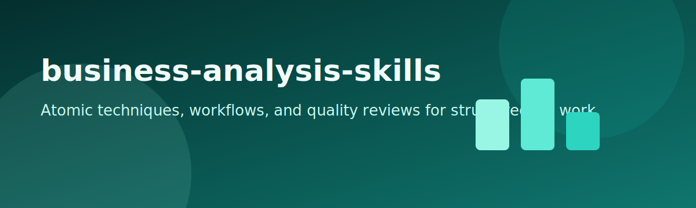

# business-analysis-skills

<p align="center">
  
</p>

<p align="center">
  
</p>

<p align="center">
  <a href="LICENSE"></a>
  
  
</p>

A platform-neutral business analysis skill pack for AI assistants. It combines atomic techniques, requirements discovery, elicitation support, end-to-end workflows, and quality review passes in one reusable repo.

## Included skills

### Atomic techniques

- `pestle-analysis`
- `swot-prioritisation`
- `porters-five-forces`
- `value-proposition-analysis`
- `stakeholder-register`
- `power-interest-grid`
- `raci-matrix`
- `interview-design`
- `questionnaire-design`
- `workshop-design`
- `observation-study-plan`
- `prototype-elicitation`
- `use-case-specification`
- `process-model-spec`
- `moscow-prioritisation`
- `see-i-clarifier`
- `catwoe-root-definition`

### Requirements and specification

- `acceptance-criteria-writer`
- `ambiguity-hunter`
- `assumption-extractor`
- `constraint-detector`
- `definition-of-done-drafter`
- `edge-case-elicitor`
- `functional-vs-nonfunctional-splitter`
- `problem-statement-refiner`
- `proto-requirements-normalizer`
- `requirements-conflict-checker`
- `requirements-gap-auditor`
- `requirements-interrogator`
- `requirements-prioritizer`
- `requirements-traceability-starter`

### Elicitation and process extensions

- `raci-rasci-builder`
- `stakeholder-communication-planner`
- `probe-question-generator`
- `pyramid-funnel-diamond-interviewer`
- `questionnaire-pilot-checker`
- `breakout-structure-designer`
- `as-is-process-investigator`
- `to-be-process-designer`
- `business-rule-extractor`
- `benefit-hypothesis-writer`

### Workflows

- `business-problem-framing`
- `strategy-analysis`
- `stakeholder-analysis`
- `requirements-elicitation`
- `process-modelling-and-improvement`
- `ssm-analysis`
- `requirements-packager`

### Quality checks

- `critical-thinking-bias-check`
- `assumptions-constraints-log`
- `evidence-gap-review`
- `deliverable-consistency-check`
- `requirements-quality-check`

## Features

- Preserves the original `atomic/`, `workflows/`, and `quality/` source grouping
- Mirrors packaged skills into both `.claude/skills/` and `.agents/skills/`
- Supports broad BA work from discovery through structured deliverables
- Adds requirements discovery, traceability, and elicitation-support skills missing from the original repo
- Keeps quality checks separate so deliverables can be reviewed before handoff

## Install

### Option A: Install globally

```bash
git clone https://github.com/45ck/business-analysis-skills.git
cd business-analysis-skills
bash install.sh
```

This installs every packaged skill into both:

- `~/.claude/skills/`
- `~/.agents/skills/`

### Option B: Copy into a project

```bash
cp -R .claude /path/to/your-project/
cp -R .agents /path/to/your-project/
```

### Uninstall

```bash
bash uninstall.sh
```

## Usage

Use workflow skills first for broad problem spaces, atomic skills for specific BA techniques, and quality skills before finalizing a deliverable.

```text
/business-problem-framing claims triage process
/stakeholder-analysis payroll replacement program
/requirements-elicitation onboarding workflow
/process-modelling-and-improvement invoice approval process
/requirements-packager convert discovery notes into a delivery-ready requirements pack

/swot-prioritisation launch of a student support portal
/porters-five-forces local food delivery platform
/raci-matrix identity migration project
/raci-rasci-builder delivery team responsibilities
/use-case-specification submit and approve leave request
/process-model-spec incident escalation workflow
/requirements-interrogator stakeholder notes from workshop
/acceptance-criteria-writer password reset requirements
/requirements-traceability-starter MVP scope
/as-is-process-investigator current procurement workflow
/to-be-process-designer improved procurement workflow
/business-rule-extractor policy document and ops notes

/evidence-gap-review proposed CRM migration
/requirements-quality-check draft booking requirements
/deliverable-consistency-check BA artifact pack
```

## Repo structure

```text
atomic/                              original source grouping
workflows/                           original source grouping
quality/                             original source grouping
.claude/skills/<skill>/SKILL.md      packaged skill format
.agents/skills/<skill>/SKILL.md      mirrored packaged skill format
docs/ba/templates/                   reusable BA templates
install.sh                           global installer
uninstall.sh                         global uninstaller
LICENSE                              MIT
```

## Related skill packs

- [software-architecture-skills](https://github.com/45ck/software-architecture-skills) - Architecture options, views, risks, and tradeoff writing
- [data-structures-algorithmic-reasoning-skills](https://github.com/45ck/data-structures-algorithmic-reasoning-skills) - Data structure selection and algorithmic reasoning skills
- [oop-code-structure-skills](https://github.com/45ck/oop-code-structure-skills) - Object-oriented design and class-structure review skills
- [web-engineering-skills](https://github.com/45ck/web-engineering-skills) - Web request handling, MVC, validation, routing, and navigation skills
- [backend-persistence-skills](https://github.com/45ck/backend-persistence-skills) - Persistence, schema, ORM, query, and migration skills
- [enterprise-architecture-integration-skills](https://github.com/45ck/enterprise-architecture-integration-skills) - Enterprise topology, integration, messaging, and cloud skills
- [uml-analysis-modelling-skills](https://github.com/45ck/uml-analysis-modelling-skills) - UML analysis and modelling skills
- [marketing-product-skills](https://github.com/45ck/marketing-product-skills) - Product strategy, growth, positioning, launch, SEO, and pricing skills
- [hci-review-skill](https://github.com/45ck/hci-review-skill) - Structured HCI and UX review skills for prototypes and product interfaces
- [fagan-inspection-skill](https://github.com/45ck/fagan-inspection-skill) - Formal inspection and defect-review skills for code changes

## License

[MIT](LICENSE)
